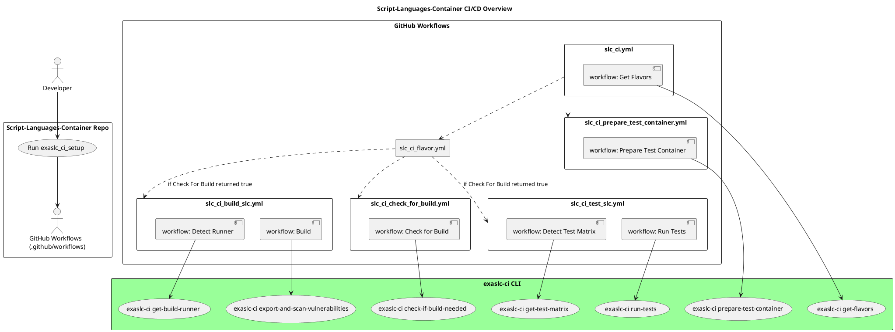

# exaslc-ci CLI — User Guide

**EXASLC_CI** is a command-line tool to build, test, scan and deploy Exasol’s Script-Languages Containers  
in a GitHub CI environment. See https://github.com/exasol/script-languages-release for more information about  
Script-Languages-Container. Under the main entrypoint `exaslc-ci`, it exposes a set of commands to  
orchestrate your CI pipeline steps.


## Installation & Prerequisites

1. Python 3.10+  
2. Install the package:

   ```shell
   pip install exaslc-ci
   ```

3. Ensure a valid GitHub token in your CI (`GITHUB_TOKEN`) if using GitHub outputs.

---

## How it fits in the big picture

The following diagram shows how this project is used within the Script-Languages-Container CI/CD pipeline.  
The auto-generated GitHub workflows call the CLI commands of this project to construct build matrices or to trigger the single build steps.



---

## Global Usage

```shell
Usage: exaslc-ci [OPTIONS] COMMAND [ARGS]...

  EXASLC_CI - Exasol Script Languages Continuous Integration

Options:
  --help    Show this message and exit.
```

Run `exaslc-ci COMMAND --help` for detailed options per command.

---

## Commands

### get-flavors

Searches for all available container “flavors” (e.g. `standard-EXASOL-all-python-3.10`, `template-Exasol-all-r-4`)  
and writes the result as a JSON array to a GitHub Actions output variable.

<u> Usage </u>

```shell
exaslc-ci get-flavors --github-output-var FLAVOR_LIST
```

<u> Options </u>

- `--github-output-var TEXT`  
  Name of the GitHub Actions output variable to store the resulting JSON array. **(Required)**

#### Example (GitHub Actions)

```yaml
- name: Get available flavors
  run: exaslc-ci get-flavors --github-output-var flavors
  env:
    GITHUB_OUTPUT: ${{ github.output }}
```

---

### get-test-matrix

Generates a test matrix for a given flavor and writes it into a GitHub Actions output variable.

<u> Usage </u>

```shell
exaslc-ci get-test-matrix --flavor standard-EXASOL-all-python-3.10 --github-output-var MATRIX
```

<u> Options </u>

- `--flavor TEXT`  
  The container flavor to generate the test matrix for. **(Required)**
- `--github-output-var TEXT`  
  GitHub Actions output variable name. **(Required)**

#### Example

```yaml
- name: Generate test matrix
  run: exaslc-ci get-test-matrix --flavor standard-EXASOL-all-python-3.10 --github-output-var matrix
  env:
    GITHUB_OUTPUT: ${{ github.output }}
```

---

### get-build-runner

Resolves which GitHub runner labels (e.g. `ubuntu-latest`/`windows-latest`) should be used to build a given flavor.

<u> Usage </u>

```shell
exaslc-ci get-build-runner --flavor standard-EXASOL-all-python-3.10 --github-output-var RUNNER_LABELS
```

<u> Options </u>

- `--flavor TEXT`  
  Flavor identifier. **(Required)**
- `--github-output-var TEXT`  
  GitHub Actions output variable. **(Required)**

---

### check-if-build-needed

Checks whether a new build is needed by comparing the current branch vs. a base branch.  
Outputs a boolean (`true`/`false`) to a GitHub variable.

<u> Usage </u>

```shell
exaslc-ci check-if-build-needed \
  --flavor standard-EXASOL-all-python-3.10 \
  --branch feature/XYZ \
  --base-ref main \
  --remote origin \
  --github-output-var NEED_BUILD
```

<u> Options </u>

- `--flavor TEXT`
- `--branch TEXT`
- `--base-ref TEXT`
- `--remote TEXT`
- `--github-output-var TEXT`

---

### export-and-scan-vulnerabilities

Performs a full CI pipeline step: builds the container, exports it, scans for vulnerabilities, and pushes results to the Docker Hub build cache.

<u> Usage </u>

```shell
exaslc-ci export-and-scan-vulnerabilities \
  --flavor standard-EXASOL-all-python-3.10 \
  --branch feature/XYZ \
  --commit-sha abc123 \
  --docker-user ${{ secrets.DOCKER_USER }} \
  --docker-password ${{ secrets.DOCKER_PASS }} \
  --github-output-var VULN_SCAN_RESULT
```

<u> Options </u>

- `--flavor TEXT`
- `--branch TEXT`
- `--commit-sha TEXT`
- `--docker-user TEXT`
- `--docker-password TEXT`
- `--github-output-var TEXT`

#### Internals

1. Build the container  
2. Run a security scan  
3. Export the container  
4. Push results  

---

### prepare-test-container

Builds a test container image from a given commit, then pushes it to your registry.  
The test container must contain its own build description (Dockerfile), the test SQL data and the UDF tests.

<u> Usage </u>

```shell
exaslc-ci prepare-test-container \
  --commit-sha abc123 \
  --docker-user ${{ secrets.DOCKER_USER }} \
  --docker-password ${{ secrets.DOCKER_PASS }}
```

<u> Options </u>

- `--commit-sha TEXT`
- `--docker-user TEXT`
- `--docker-password TEXT`

---

### run-tests

Runs integration tests inside a previously built/test container.

<u> Usage </u>

```shell
exaslc-ci run-tests \
  --flavor standard-EXASOL-all-python-3.10 \
  --slc-directory ./build/slc \
  --test-set-name full \
  --docker-user ${{ secrets.DOCKER_USER }} \
  --docker-password ${{ secrets.DOCKER_PASS }}
```

<u> Options </u>

- `--flavor TEXT`
- `--slc-directory PATH`  
  Directory where the built SLC file resides.
- `--test-set-name TEXT`
- `--docker-user TEXT`
- `--docker-password TEXT`

---

## Troubleshooting & Support

If you encounter errors or missing functionality, please open a GitHub ticket:  
https://github.com/exasol/script-languages-container-ci/issues/new/choose
